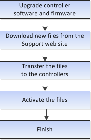

= Fluxo de trabalho para atualização de software e firmware do controlador
:allow-uri-read: 
:icons: font
:imagesdir: ../media/

[role="lead"]
No Gerenciador de sistema do SANtricity, você pode atualizar o software e o firmware do controlador seguindo estas etapas.

