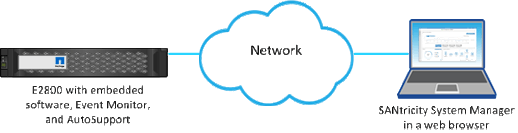

= Considerações para acessar o System Manager
:allow-uri-read: 
:icons: font
:imagesdir: ../media/

[role="lead"]
Selecione um ou mais storages e use a opção Iniciar para abrir o System Manager quando quiser configurar e gerenciar storages.

O System Manager é uma aplicação incorporada nos controladores, que está ligada à rede através de uma porta de gestão Ethernet. Ele inclui todas as funções baseadas em array.

Para acessar o System Manager, você deve ter:

* Um dos modelos de array listados aqui: link:https://docs.netapp.com/us-en/e-series/getting-started/learn-hardware-concept.html["Visão geral do hardware e-Series"^]
* Uma conexão fora da banda a um cliente de gerenciamento de rede com um navegador da Web.

